# Flet Arduino Sweeper Car--Ca-R-oomba
I built an Arduino-powered sweeper-car, named Ca-R-oomba, controlled via the serial port with a custom Python and Flet application.

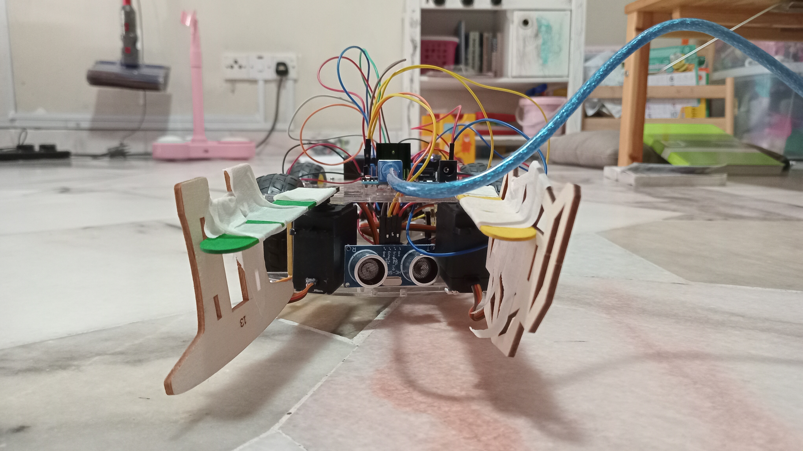

 
## The idea 💡
I wanted to build a remote-controlled *something*. A car seemed like the simplest choice, but after seeing all the available youtube videos online, I needed to make mine different. I decided to do 3 things: 
- Use the **Serial port**, not Bluetooth
- Build **my own app** to control the car
- Add a **sweeper** to make it a roomba

 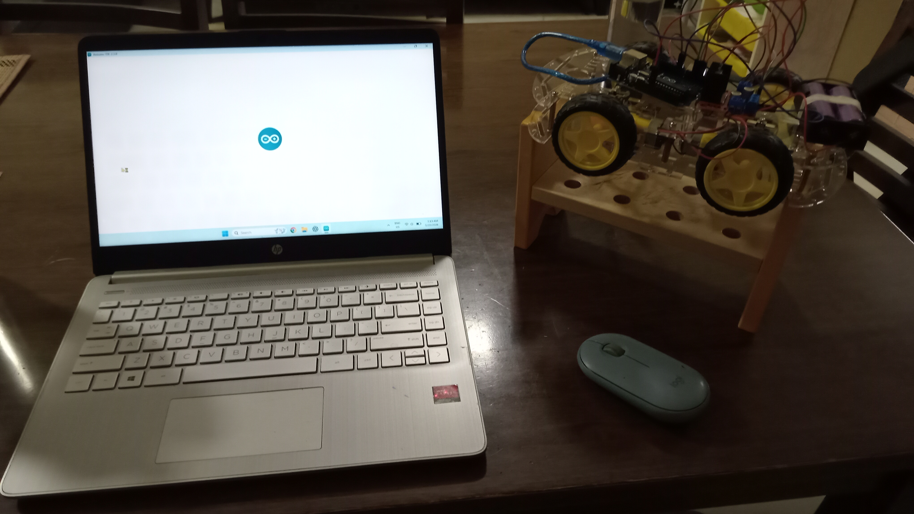

And I named it, the **Ca-R-oomba**. I made this project in phases. 

## Phase 1: Learning Flet
I chose to use the **Flet Python programming framework** because I already had some background in Python, and it seemed the most beginner-friendly. I followed [this](//www.youtube.com/watch?v=jqAQ4oQGUH0) youtube tutorial video to learn the basics.

 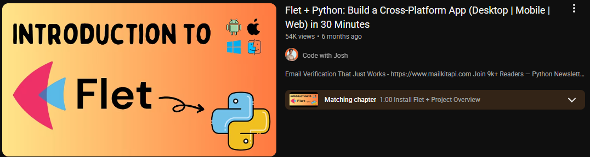

Then, I built a test app to experiment with the future car contorls, which I have posted as its own repo on my profile. 

  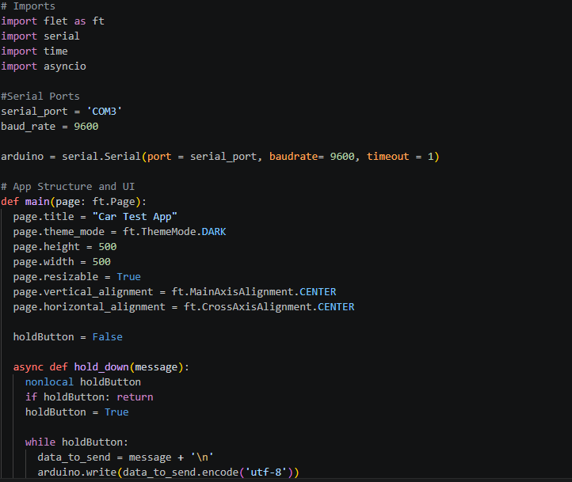
 

## Phase 2: Building the Car
This was the simplest part of the project. I followed another youtube tutorial online and wired the motors so they would spin in a given direction. 

 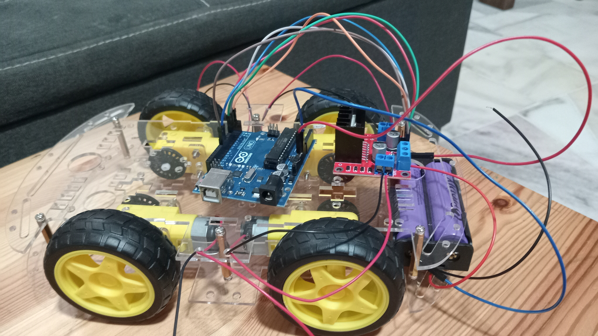
 

## Phase 3: Learning to communicate VS code with Arduino using serial
I learned this by creating a test app which allowed *serial signals* to be sent to the arduino and read back to the command line based on instructions from the Arduino. I used the `pyserial` library for this. 

 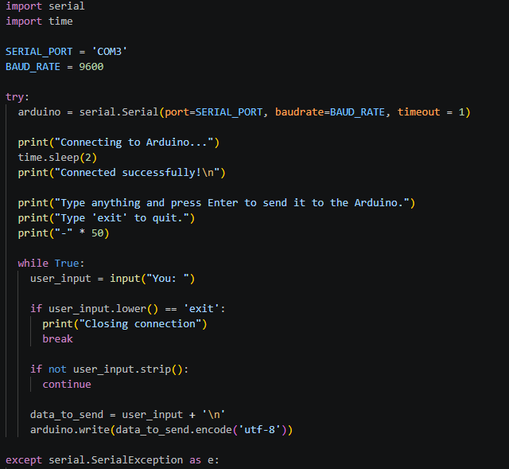

## Phase 4: Building the Car App
At first, I made the buttons **click-only**, which meant I had to click several times to move the car. It worked, though. 

 

I decided to transition to making the buttons hold-able. I switched from `.IconButton()` to `.GestureDetector()` in a `.Container()` to allow button-holds to be detected. The buttons transmit a **specific signal** to the Arduino when pressed and when held, enabling the car to respond to commands accordingly. I added a *title* to the app and gave it a `.TextField()` to display the current direction of the car. I also used `async` to not freeze the user interface.

 
 

## Phase 5: Building the Arduino Code
I seperated the *driving-aspect* of the car into its own **header file** so as to not clutter the main file, and name it `driving_module.h`. In that file, I created a Car Class to store the pins, the setup function via the constructor, and the various direction functions for moving `forward()`, `backward()`, `left()`, `right()` and `stop()`. Additionally, I created a `commmand()` function to take the serial signal from the Flet App and map it to its specific function. 

 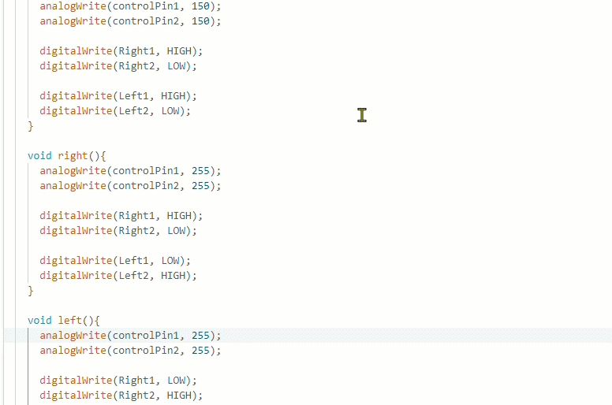

## Phase 6: Testing the Car
With Phases 1-5 completed, it was time to test the car. It took a bit of rewiring and code corrections, but everything worked as expected. The Flet App sent the correct signals and the car moved accordingly. 

  

*Controller may not be in sync with car movement, but I did control it in this gif. Editing was a bit rough*

## Phase 7: Learning the HC-SR04 and integrating with MG995 servos
For the car to detect objects in its path, I needed to use the **HC-SR04** to detect whether an object was within **sweeping range, 6cm**. I learned it using another youtube tutorial, and integrated it with the servos to make them turn *70 degrees* when an object was detected.

  

After that, I created a `sweeper_module.h` file to store these functions: `check_distance_cm()`, which took two ints for the trigger and echo pins, and `sweep()`, which took two servo **objects** and a `boolean` to check whether an object was in range. 

 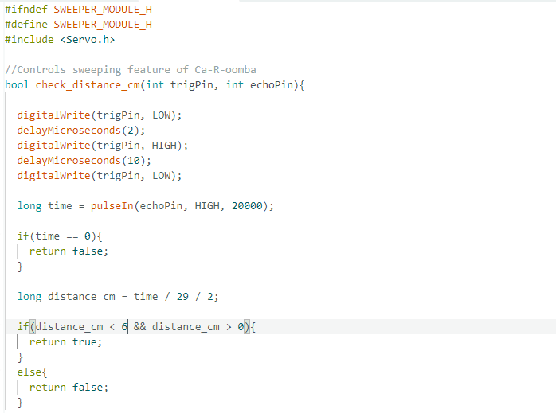

## Phase 8: Integrating sweepers with the car
The additional components meant I needed to reopen the car, rewire the cables through a **small breadboard**, and connect the extra components to a battery and the Arduino. 

 
 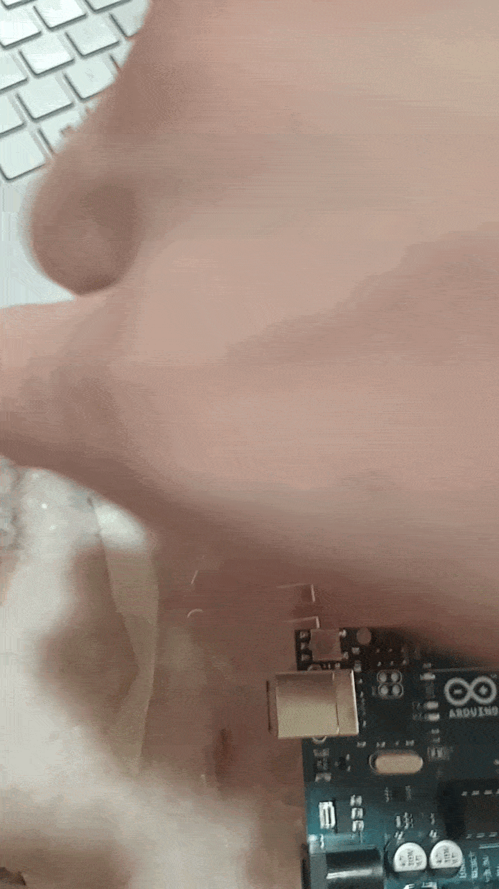

 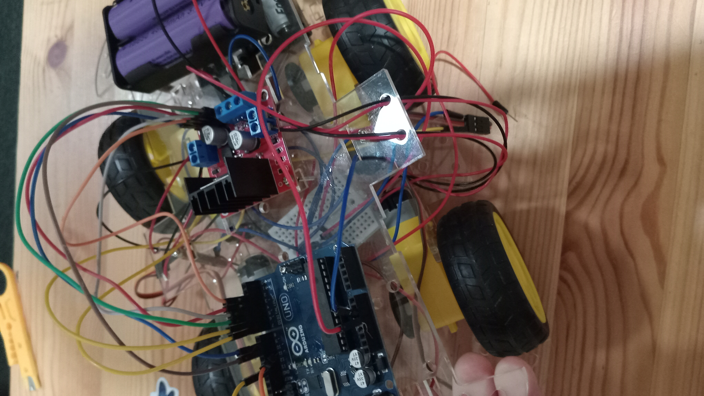

  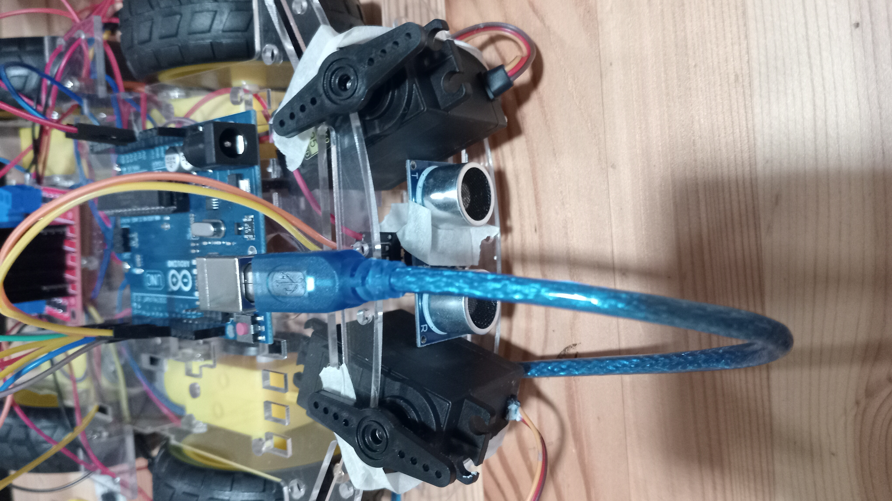

## Phase 9: Getting the car and the sweeper to work simultaneously
This was the **toughest problem** in thsi project. The delay time in the servos stopped the Arduino from executing the commands from the flet app, and the serial would not clear, meaning the commands would get executed all at once, which was a chaotic sight. I used `boolean` variables to check for whether there is and was an object in the car's path, used `Serial.available() > 0` to rpevent the serial buffer from freexing, and moved the sweeping to the top of the `loop()` so it would execute and not interrupt the car commands. 

 

## Final Phase: Final tests
After making it through phase 9, I conducted a test of the car and sweepers by placing a sharpener in its path, have it sweep it away, and continue moving. I was glad to see all the systems worked correctly. 

 

 

### Code Links
- Arduino Code: [Click Here](./code/serial-car-controller-folder(Arduino%20Code))
- Serial Car Controller App: [Click Here](./code/serial_car_app.py)
- First Car Test App: [Click Here](https://github.com/ArifNaufalMNazri/Car-Controls-Test-App/blob/main/cartestapp.py)
- Communcating Serial Port to Arduino Test: [Click Here](./code/com_Arduino_test.py)
- First App Made: [Click Here](./code/learning_flet.py)

## Parting Thoughts
I am happy to have learnt app development, hardware integration, serial and IDE communication through this project. I learned a lot about `async`, running systems simultaneously and more. I hope to bring these skills forward in my future projects. 

#### Final Blooper

 

